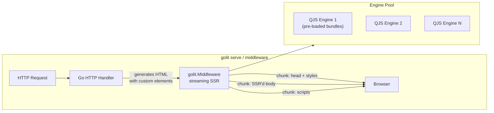

# Server Mode: Request-Time SSR with Streaming

## Use Cases

Static site post-processing (`golit transform`) covers Hugo and other SSGs. But many Go applications need request-time SSR:

- **Go web servers** (net/http, Chi, Echo, Gin) serving dynamic pages with web components
- **Edge rendering** at CDN workers where HTML is assembled per-request
- **API-driven sites** where page content depends on user auth, A/B tests, or real-time data
- **Hybrid sites** with mostly-static pages but some dynamic routes

## Architecture




## Two Integration Points

### 1. HTTP Middleware (`pkg/middleware/`)

A standard `net/http` middleware that wraps any Go HTTP handler. It intercepts the response, SSR's custom elements, and streams the result:

```go
import "github.com/sspriggs/golit/pkg/middleware"

// Create SSR middleware with pre-loaded bundles
ssr, err := middleware.New(middleware.Options{
    BundlesDir: "bundles/",
    // OR
    SourcesDir: "node_modules/@rhds/elements/elements/",
    // OR
    ImportMap:  "importmap.json",
    
    Ignore: []string{"rh-tooltip", "rh-dialog"},
    
    // Engine pool size (default: runtime.NumCPU())
    PoolSize: 4,
})

mux := http.NewServeMux()
mux.Handle("/", ssr.Wrap(myHandler))
http.ListenAndServe(":8080", mux)
```

### 2. Standalone Server (`golit serve`)

A CLI command that serves a directory of HTML files with on-the-fly SSR:

```bash
golit serve public/ --port 8080 --sources node_modules/@rhds/elements/elements/
```

Useful for development and preview. Serves static files but intercepts HTML responses to inject DSD.

## Key Technical Challenges

### Engine Pool

QJS engines are NOT goroutine-safe (single-threaded WASM). For concurrent HTTP requests, we need a pool of pre-initialized engines:

```go
type EnginePool struct {
    pool    chan *jsengine.Engine
    bundles *jsengine.Registry
}

func (p *EnginePool) Acquire() *jsengine.Engine { return <-p.pool }
func (p *EnginePool) Release(e *jsengine.Engine) { p.pool <- e }
```

Each engine in the pool has all bundles pre-loaded. On request, acquire an engine, render, release it back. Pool size = number of concurrent SSR requests supported.

### Streaming

The current `RenderHTML` reads the entire HTML, transforms it, returns the entire result. For streaming:

1. **Parse incrementally**: Use Go's `html.Tokenizer` instead of `html.Parse` to process the HTML token-by-token
2. **Stream through**: Write non-custom-element tokens directly to the response
3. **Buffer custom elements**: When a custom element opens, buffer its content until the closing tag, SSR it, then write the DSD
4. **Flush after each component**: Call `http.Flusher.Flush()` after writing each SSR'd component so the browser gets it immediately

This gives progressive rendering: the `<head>` with styles is sent first, then each component's DSD is streamed as it's rendered.

```go
func (m *Middleware) streamSSR(w http.ResponseWriter, html io.Reader) {
    flusher, _ := w.(http.Flusher)
    tokenizer := html.NewTokenizer(html)
    
    for {
        tt := tokenizer.Next()
        switch tt {
        case html.StartTagToken:
            tag := tokenizer.Token()
            if isCustomElement(tag.Data) && m.registry.Has(tag.Data) {
                // Buffer until closing tag, SSR, write DSD
                rendered := m.renderElement(tag)
                w.Write(rendered)
                flusher.Flush()
            } else {
                w.Write(tag.Raw())
            }
        // ... other token types pass through
        }
    }
}
```

### Response Interception

The middleware needs to capture the upstream handler's response before it goes to the client. Use a `ResponseRecorder`-like wrapper, but streaming:

```go
type ssrResponseWriter struct {
    http.ResponseWriter
    pipeWriter *io.PipeWriter  // upstream writes here
    pipeReader *io.PipeReader  // SSR reads from here
}
```

The upstream handler writes HTML to the pipe. The SSR goroutine reads from the pipe, transforms on-the-fly, and writes to the real `ResponseWriter`. This avoids buffering the entire response in memory.

### Caching

For mostly-static pages, cache the SSR'd output keyed by URL (or a custom cache key). Invalidate on deploy or TTL. This makes repeated requests instant.

```go
ssr, err := middleware.New(middleware.Options{
    Cache:    middleware.NewMemoryCache(1000), // LRU, 1000 entries
    CacheTTL: 5 * time.Minute,
})
```

## New CLI Command

```bash
golit serve <dir> [--port 8080] [--defs bundles/] [--sources dir/] [--importmap file]
```

## New Packages

- `pkg/middleware/` -- HTTP middleware, engine pool, response interception
- `pkg/middleware/cache.go` -- Optional response caching
- `pkg/jsengine/pool.go` -- Engine pool management

## Implementation Phases

### Phase 1: Engine Pool

Create a pool of pre-loaded QJS engines for concurrent use. This is the foundation for both middleware and `golit serve`.

### Phase 2: HTTP Middleware

Implement `middleware.New()` and `middleware.Wrap()`. Non-streaming first -- buffer the full response, transform, write.

### Phase 3: Streaming

Replace the buffered approach with tokenizer-based streaming. Use `io.Pipe` + goroutine for concurrent read/transform/write.

### Phase 4: `golit serve` CLI

Static file server with SSR middleware. Development/preview tool.

### Phase 5: Caching

LRU cache for SSR'd responses. Optional, configurable TTL.

## Performance Targets

- Engine pool initialization: ~400ms per engine (WASM cold start), done once at startup
- Per-component render: <5ms (QJS execution)
- Streaming TTFB: <50ms for the `<head>` section
- Concurrent requests: Limited by pool size (default: NumCPU)
- Memory: ~50MB per engine instance (QJS WASM + loaded bundles)

